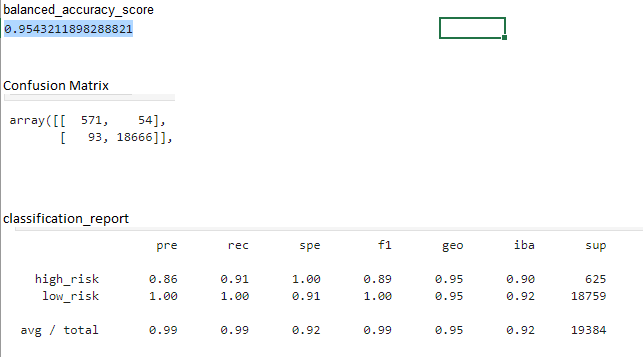
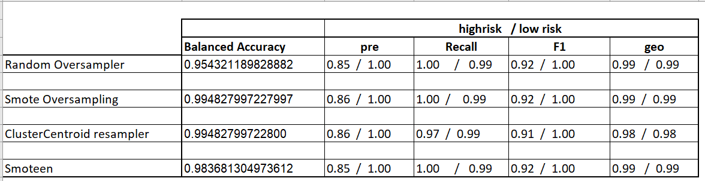
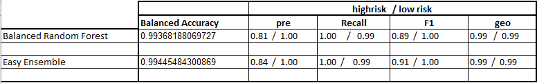
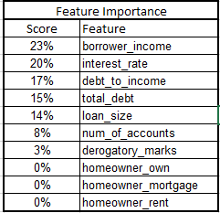

# Classification

In this project we will use machine learning techniques to predict credit risks. We analysed some lending data which we then used to train different models and then evaluated the predicted results.  All models followed the same process of "model->fit->predict "

## Credit Risk Resampling
Using the Linear regression model, the following results were obtained:

This model is approximately 95% correct.

In terms of predicting risk, our priority may be to accurately predict the high risk class, as such we might want to reduce the false negatives in this class. For that we would focus on the recall scores. The recall score on this model was 0.91  

### Over/Under Sampling

We then used oversampling and undersampling models to test the data. There were very little differences between the results of each model when we compared the balanced accuracy scores and the  imbalanced classification reports.

Summary of results:

The Smote oversampling and ClusterCentroid resampler returned the best Accuracy score. However when it comes to the imbalanced classificatiob reports, they were almost all the same. This could be due to the fact that the data sample was not large enough or too much over/under sampling.

## Credit Risk Ebsemble

We Used the same data to  train and compare two different ensemble classifiers to predict loan risks. (1) Balanced Random Forest Classifier and (2) Easy Ensemble Classifier. We also evaluated these models based on the Balanced accuracy scores and the imbalanced classification reports.

Summary of results:

 Easy Ensemble had a slightly better accuracy score however both models had identical recall scores and geometric means.

 For the Balanced random Forest classifier, the following is the feature importance, in order of importance.

 

The top three features were Borowwer's income - 23%,  Interest rate - 20% and Debt to income - 17%.